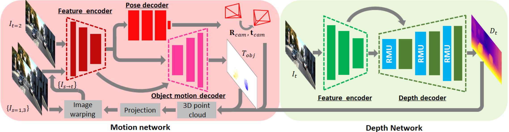

# RM-Depth
This repository (https://github.com/twhui/RM-Depth) is the offical project page for my paper <a href="https://arxiv.org/pdf/2303.04456.pdf"><strong>RM-Depth: Unsupervised Learning of Recurrent Monocular Depth in Dynamic Scenes</strong></a> published in CVPR 2022. <i>The up-to-date version of the paper is available on <a href="https://arxiv.org/pdf/2303.04456.pdf"><strong>arXiv</strong></a></i>. 

<a href="https://www.youtube.com/watch?v=0r4Je86w1Cg">

</a>

# Overview

RM-Depth is proposed for unsupervised joint learning of single-image depth map, ego-motion, and object motion in general scenes. Optical flow can also be recovered by explicit computation. The depth network utilizes Recurrent Modulation Units (RMU) to adaptively and iteratively combine encoder and decoder features. Residual upsampling is used to facilitate the learning of edge-aware filters. The motion network estimates a 3D motion field of moving objects. This breaks down the scene rigidity assumption and allows to use general videos for the unsupervised learning. The proposed innovations lead to the improved depth accuracy despite not using any segmentation labels.

# Recurrent Modulation Unit (RMU)

Fusion of feature maps across encoder and decoder often appears in depth estimation. In RM-Depth, the depth decoder consists of RMUs. The fusion is iteratively refined by adaptive modulating the encoder features using the hidden state of RMU. This in turn improves the performance of single-image depth inference.

# Residual upsampling
Conventionally, feature maps are upsampled using a single set of filters. In this work, multiple sets of filters are proposed such that each set of them is specifically trained for upsampling some of the spectral components. This effectively improves upsampling along edges.

# Motion Network

Besides camera motion, a 3D motion field of moving objects is recovered in a coarse-to-fine framework through a warping approach. The unsupervised learning of motion field is further improved by introducing an outlieraware regularization loss.

# Depth Prediction Results
</ul>
<table>
<thead>
<tr>
<th align="center"></th>
<th align="center">Semantic Prior</th> 
<th align="center">KITTI Testing Set (Eigen split)</th>
<th align="center">Cityscapes Testing Set</th>
<th align="center">Model Size (M)</th> 
</tr>
<tr>
<td align="center">Monodepth2 (ICCV19)</td>
<td align="center"></td>  
<td align="center">0.115</td>
<td align="center">-</td>
<td align="center">14.84</td>
</tr> 
<tr>
<td align="center">PackNet (CVPR20)</td>
<td align="center"></td>  
<td align="center">0.111</td>
<td align="center">-</td>
<td align="center">128.29</td>
</tr>
<tr>
<td align="center">Lee et al. (ICCV21)</td>
<td align="center">&#x2022</td> 
<td align="center">0.114</td>
<td align="center">0.116</td>
<td align="center">22.77</td>
</tr>
<tr>
<td align="center">Lee et al. (AAAI21)</td>
<td align="center">&#x2022</td> 
<td align="center">0.112</td>
<td align="center">0.111</td>
<td align="center">14.84</td>
</tr> 
<tr>
<td align="center"><strong>RM-Depth (CVPR22),  updated results</strong></td>
<td align="center"></td> 
<td align="center"><strong>0.107 (trained on K)</strong> (<a href="https://www.dropbox.com/s/4rfnkvtvp1bvmt6/RM-Depth_KITTI_predictions.rar?dl=0">predictions</a>)<strong>,  0.105 (trained on CS+K)</strong> (<a href="https://www.dropbox.com/s/w2pu52jiwenberz/RM-Depth_KITTI_predictions%20%28trained%20on%20CS%2BK%29.rar?dl=0">predictions</a>)</td>
<td align="center"><strong>0.090</strong> (<a href="https://www.dropbox.com/s/yc6xxfgkoay1svs/RM-Depth_CS_predictions.rar?dl=0">predictions</a>)</td>
<td align="center"><strong>2.97</strong></td>
</tr>    
</tbody></table>

# Code Package
Please contact Dr. T.-W. Hui (e-mail provided in the first page of the paper) for research or commerical collaborations.

# License and Citation
This software and associated documentation files (the "Software"), and the research paper (<i>RM-Depth: Unsupervised Learning of Recurrent Monocular Depth in Dynamic Scenes</i>) including but not limited to the figures, and tables (the "Paper") are provided for academic research purposes only and without any warranty. Any commercial use requires my consent. When using any parts of the Software or the Paper in your work, please cite the following paper:

<pre><code>@InProceedings{hui22rmdepth,
 author = {Tak-Wai Hui},
 title = {RM-Depth: Unsupervised Learning of Recurrent Monocular Depth in Dynamic Scenes},
 booktitle = {Proceedings of IEEE Conference on Computer Vision and Pattern Recognition (CVPR)},
 pages = {1675--1684},
 year = {2022}
}</code></pre>
